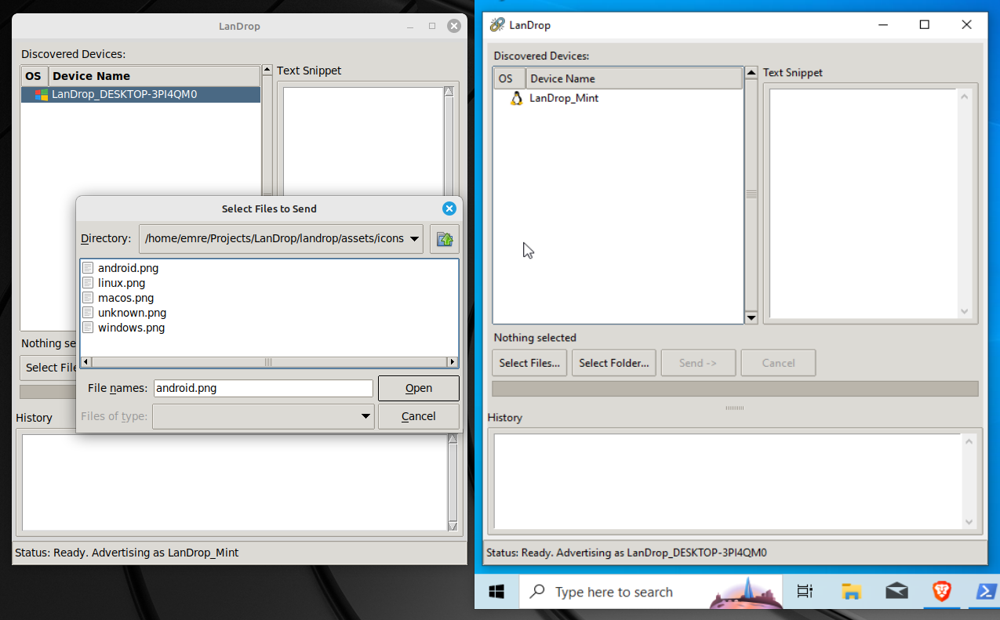
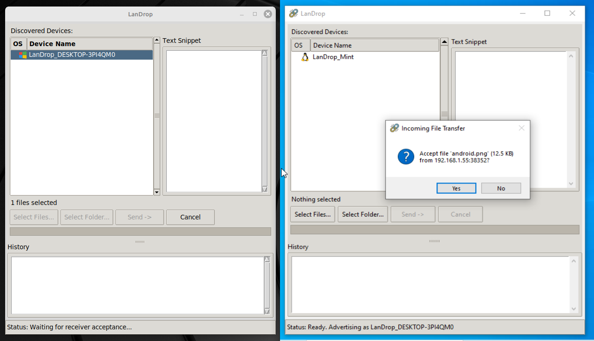
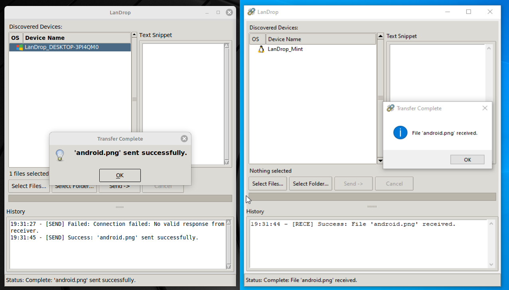
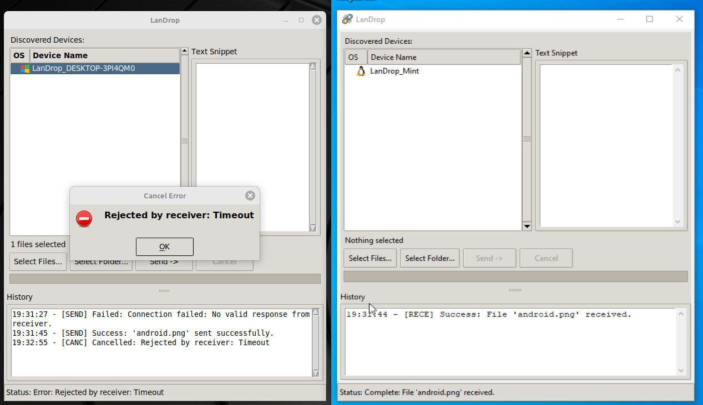
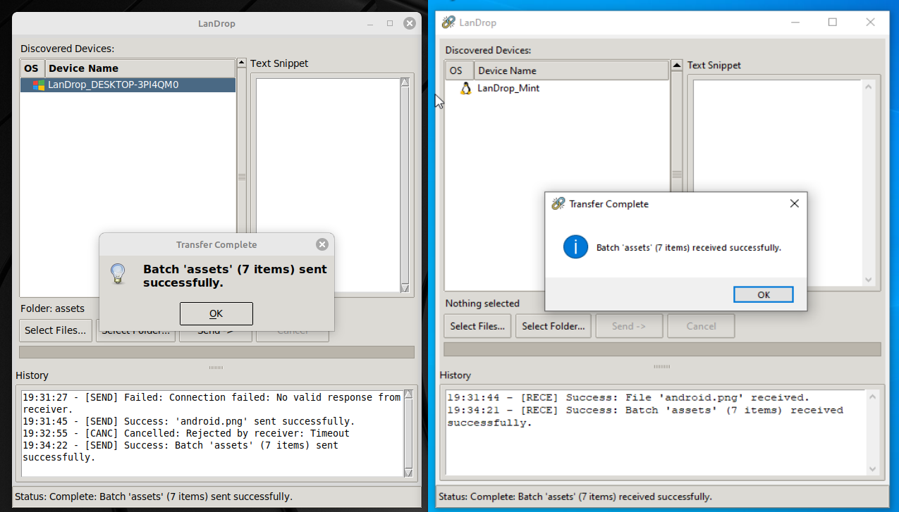
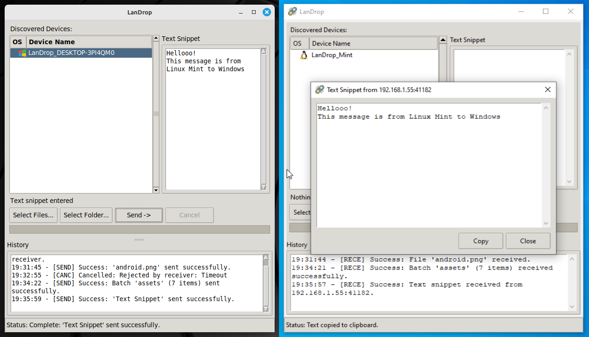

# LanDrop 💧

 <!-- Optional: Add your logo here -->

**LanDrop** is a simple, cross-platform tool for transferring files, folders, and text snippets directly between devices on your local network. It uses Zeroconf (Bonjour/Avahi) for automatic device discovery, eliminating the need to manually enter IP addresses.

## Features

- **Automatic Device Discovery:** Finds other LanDrop instances on your LAN automatically.
- **Cross-Platform:** Tested on Linux (Mint) and Windows. Should work on macOS with appropriate dependencies.
- **File Transfer:** Send single files.
- **Folder Transfer:** Send entire folders, including subdirectories.
- **Multi-File Transfer:** Select and send multiple files at once.
- **Text Snippet Transfer:** Quickly send clipboard content or short messages.
- **Confirmation:** Option to confirm incoming transfers.
- **Progress Display:** Shows transfer progress, speed, and estimated time remaining.
- **History Log:** Keeps a simple log of recent transfer activity.
- **(Optional) TLS Encryption:** Basic self-signed certificate generation and usage for encrypted transfers (primarily for testing/privacy on trusted networks).

## Screenshots








## Installation

1.  **Prerequisites:**

    - **Python:** Version 3.10 or higher recommended.
    - **Tkinter:** Usually included with Python. If not, install it for your OS:
      - _Debian/Ubuntu:_ `sudo apt update && sudo apt install python3-tk`
      - _Fedora:_ `sudo dnf install python3-tkinter`
      - _macOS:_ Should be included with Python from python.org. Ensure Tk is available if using other distributions (like Homebrew).
      - _Windows:_ Included with standard Python installations.
    - **(Linux)** **Avahi Daemon:** For Zeroconf discovery. Usually installed by default on desktop distributions. Ensure the `avahi-daemon` service is running. (`sudo systemctl status avahi-daemon`).

2.  **Clone the Repository:**

    ```bash
    git clone https://github.com/Mordris/LanDrop-file-transfer-over-network # Replace with your repo URL
    cd LanDrop
    ```

3.  **Create and Activate Virtual Environment (Recommended):**

    ```bash
    python3 -m venv venv
    # On Linux/macOS:
    source venv/bin/activate
    # On Windows (Command Prompt):
    .\venv\Scripts\activate.bat
    # On Windows (PowerShell):
    .\venv\Scripts\Activate.ps1
    ```

4.  **Install Dependencies:**
    ```bash
    pip install -r requirements.txt
    ```
    _(`Pillow` is needed for icon display, `pyperclip` for text copy features, `cryptography` only if generating self-signed TLS certs)._

## Usage

1.  **Activate Virtual Environment** (if you created one):

    ```bash
    # Linux/macOS:
    source venv/bin/activate
    # Windows:
    .\venv\Scripts\activate
    ```

2.  **Run the Application:**

    ```bash
    python -m landrop.main
    # OR if in the project root:
    # python landrop/main.py
    ```

    _(Using `-m landrop.main` is generally preferred as it handles Python's module path resolution better)._

3.  **Sending:**

    - Launch LanDrop on both the sending and receiving devices. They should appear in each other's "Discovered Devices" list.
    - Select the target device from the list.
    - Choose **"Select Files..."**, **"Select Folder..."**, or type/paste text into the **"Text Snippet"** box.
    - Click **"Send ->"**.
    - Wait for the receiver to accept (if confirmation is enabled).

4.  **Receiving:**
    - If confirmation is enabled (`confirm_receive = true` in `config.ini`), a dialog will pop up asking you to accept or reject the incoming transfer.
    - Files/folders are saved to the directory specified in `config.ini` (defaults to your user's Downloads folder). A unique sub-directory is created for multi-file/folder transfers.
    - Received text snippets appear in a pop-up window with a "Copy" button (if `pyperclip` is installed). Text might also be automatically copied to the clipboard based on the `copy_text_to_clipboard` setting.

## Configuration

LanDrop uses a configuration file (`config.ini`) located in:

- **Windows:** `%APPDATA%\LanDrop\`
- **Linux:** `~/.config/LanDrop/` (or `$XDG_CONFIG_HOME/LanDrop/`)
- **macOS:** `~/Library/Application Support/LanDrop/`

Available options:

- `[Network]`
  - `device_name`: How your device appears to others (Default: `LanDrop_YourHostname`). _Avoid using periods (`.`) in the name._
  - `enable_tls`: `true` or `false`. Enables basic TLS encryption using self-signed certificates generated in a `certs` sub-directory next to `config.ini`. (Default: `false`)
- `[Preferences]`
  - `downloads_directory`: Path where received files/folders are saved. (Default: Attempts to find user's Downloads folder)
  - `confirm_receive`: `true` or `false`. Ask before accepting files/batches? (Default: `true`)
  - `copy_text_to_clipboard`: `true` or `false`. Automatically copy received text snippets? (Default: `true`)

## Troubleshooting

- **Devices Not Appearing:**
  - Ensure both devices are on the **same local network** (Wi-Fi or Ethernet segment).
  - Check firewalls on **both** devices. Allow Python or specifically allow incoming TCP connections on port 56789 for your private network profile.
  - **(Linux)** Ensure the `avahi-daemon` service is running.
  - **(Windows)** Ensure Network Discovery is enabled for your current network profile (usually "Private"). Make sure the network profile itself is set to "Private", not "Public".
- **Transfers Failing:** Check console logs on both sender and receiver for error messages. Network issues or firewall changes can interrupt transfers.
- **Icons Not Showing:** Ensure you have installed `Pillow` (`pip install Pillow`) and that the icon files exist in the `landrop/assets/icons/` directory. The main app icon requires `landrop/assets/LanDrop.ico` or `.png`.
- **"Invalid Header Length" / Synchronization Errors:** These were tricky bugs. Ensure you are using the latest code version. If they reappear, network conditions or specific OS interactions might be involved.

## Contributing

Contributions are welcome! Please feel free to open an issue or submit a pull request.

## License

<!-- Choose a license, e.g., MIT -->

This project is licensed under the MIT License - see the LICENSE file (you'll need to create one) for details.
